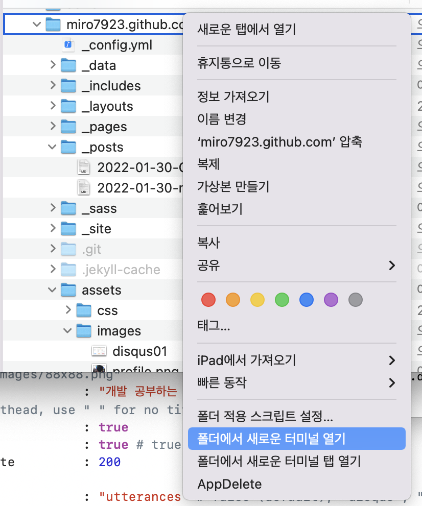
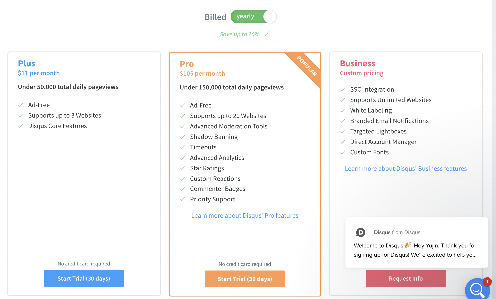
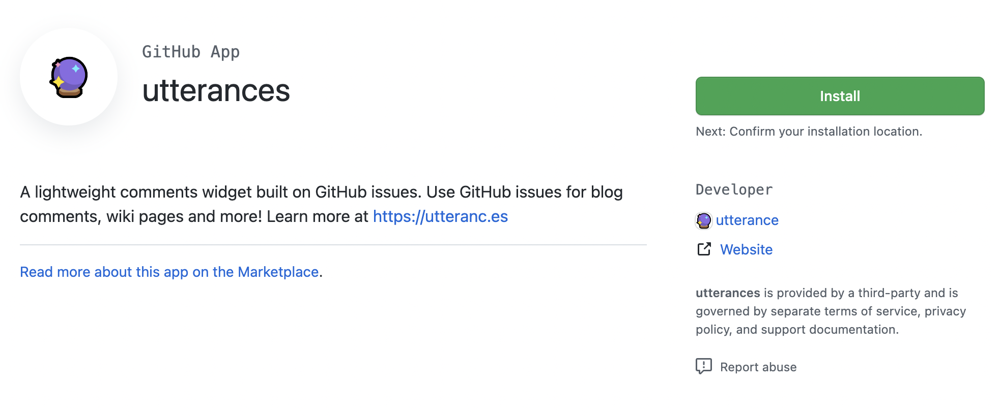
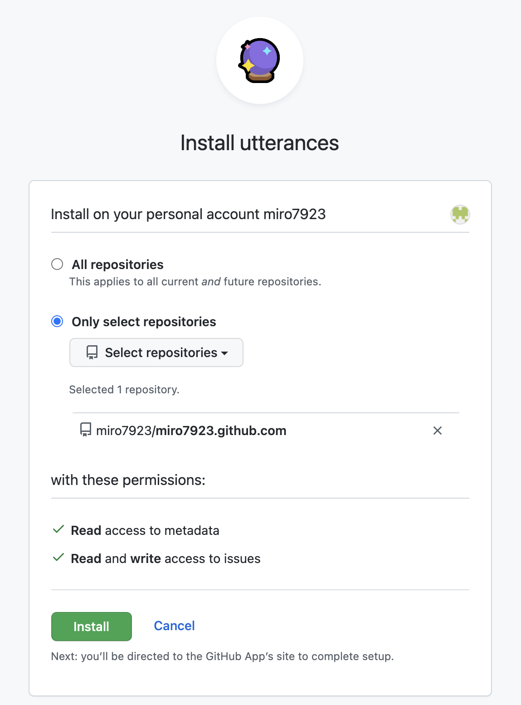
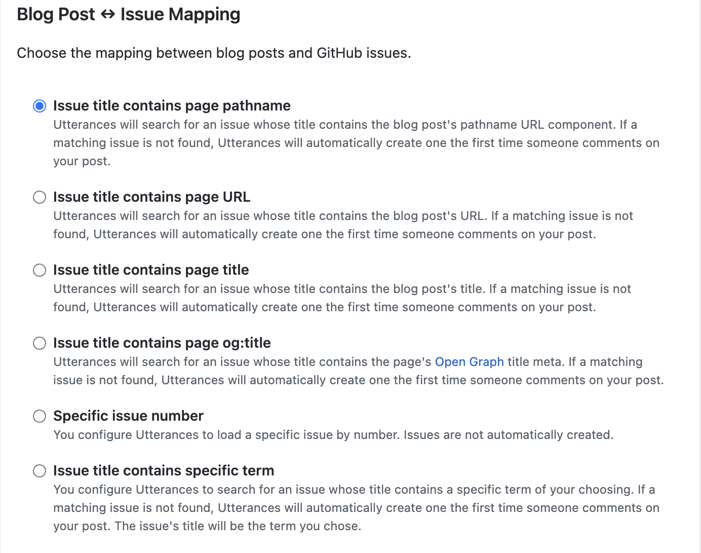
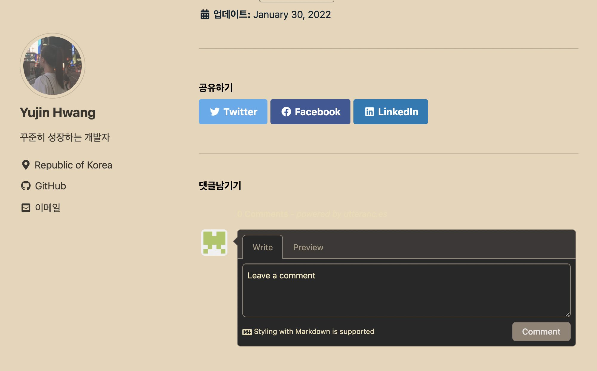

# 🎬 시작<br>
 개발 공부를 시작하고 기존에 쓰던 티스토리 블로그가 있긴 했는데 뭔가 깃헙을 이용해서 블로그를 꾸미고 여기에 공부한 내용을 올리고 싶어졌습니다. 다른 개발자 분들이 쓰시는 걸 보니까 되게 있어보이기도 하고 만들어져 있는 큰 회사(?)의 블로그를 쓰는 것 보다는 내가 직접 만들어 보면 뭔가 더 공부가 되지 않을까... 하는 생각으로 깃헙 블로그 만들기에 호기롭게 도전하게 되었습니다. <br>
 그리고 그것은 엄청난 고생길의 시작이었습니다....ㅎ<br><br>

# 0. 시작 전에... Ruby<br>
깃헙 블로그는 보통 jekyll(지킬)이라는 것을 사용해서 꾸미더라고요. 근데 저건 ruby 기반으로 만들어져 있어서 깃헙 블로그를 시작하려면 ruby를 깔아야 합니다. 전 처음에 이것도 모르고 시작했기 때문에 블로그 글을 똑같이 따라해도 안 되었던 것들이 참 많았기 때문에...ㅎ 이 글을 보시는 분들은 시작 전에 꼭 ruby를 깔고 시작하세요!<br><br>
ruby 설치 관련글은 아래 글과 같이 구글에 검색하시면 많이 보실 수 있을 것입니다.<br>
[https://ogaeng.com/jekyll-blog-install/](#https://ogaeng.com/jekyll-blog-install/)<br><br>
부디 고통받지 마시고 사전에 루비 설치하고 진행하세요...<br><br>

## +) 그리고...<br>
시작 전에 깃헙 블로그는 터미널에서 명령어를 입력하는 것을 이용해서 만들 것인데 처음 하면 이것도 뭔가 싶으실 수 있습니다.<br>
모든 블로그 글들을 따라하다 보면 터미널에서 무슨 명령어를 입력해라고 할텐데 그냥 터미널을 켜고 명령어를 입력하면 전혀 작동하지 않고 명령어로 실행하고자 하는 파일이 들어있는 위치로 이동한 다음에 해당 명령어를 입력해야 합니다.<br><br>

<br><br>
그렇기 때문에 블로그 repository가 있는 폴더에서 마우스 우클릭해서 나오는 메뉴에서 **'폴더에서 새로운 터미널 열기'** 를 선택해서 터미널을 실행하거나 <br>
```
cd /폴더경로
```
cd 명령어를 이용해 해당 파일이 있는 폴더로 이동해 모든 명령어를 입력해 주어야 합니다.<br><br>


# 1. 참고했던 글<br>
[https://zeddios.tistory.com/1222](#https://zeddios.tistory.com/1222)<br><br>
맨 처음에는 이 블로그 글을 참고해서 만들었었습니다. <br>
그런데 똑같이 따라하고 심지어 테마도 똑같은 걸로 받아 썼지만 안 되더라고요... 제 repo에 push도 잘 되는데 정작 제 블로그 페이지에 들어가보면 맨 처음에 기본으로 주는 테마에서 변경이 안 되었습니다. .gitignore 설정이 잘못 되어있나 싶어서 아예 지워도보고 기타등등 별 짓을 다 해봤지만 되질 않아서... 이 글을 따라하며 만들었던 repo를 삭제하고 다시 만들기로 다짐하면서 다른 블로그 글을 찾아 떠나게 됩니다.<br><br>
만약 이 글대로 하셔서 잘 되시면 거기서 스톱하고 나만의 블로그를 꾸미시면 됩니다. 전 되질 않아서 더 많은 시간을 소비해야만 했거든요...ㅠ <br><br>
! 그리고 테마를 설치하다 보면 거의 99% 확률로<br> 
**`require': cannot load such file -- webrick (LoadError)** <br>
이런 메세지를 보게 됩니다. 근데 다른 블로거분들은 이런걸 보신 적이 없는지 이것에 대한 언급이 아무도 없으심 ㅠ.ㅠ<br>
[https://junho85.pe.kr/1850](#https://junho85.pe.kr/1850)<br><br>
만약 저런 오류 메세지를 보시면 이 글을 참고하여 해결하시면 됩니다.<br>
```
bundle add webrick
```
무엇보다도 중요한 명령어... 전 테마를 설치할 때마다 webric을 꼭 추가해 주어야 했습니다.<br><br>

[https://honbabzone.com/jekyll/start-gitHubBlog/](#https://honbabzone.com/jekyll/start-gitHubBlog/)<br><br>
그리고 두번째로 찾은 글<br>
새로운 마음으로 다시 repo를 만들고 테마도 똑같은 걸로 다운받아서 진행했습니다. <br>
이번엔 다행히 잘 되었습니다. 😄👏👏👏<br><br>
하지만 댓글 기능을 추가하려고 disqus에 들어가 보니까 <br><br>
<br><br>
기본적으로 유료 서비스더라고요... 무료 서비스도 있긴 한데 무겁고 광고가 붙는다고 해서 disqus는 쓰지 않고 오픈소스에다 가벼운 utterances를 쓰기로 했습니다.<br><br>

# 2. utterances로 댓글 기능 만들기<br>
사실 영어를 그닥 좋아하지 않아서(^^;) 최대한 한국인이 쓴 글을 구글링 해서 찾는 편이지만 제가 쓰는 테마는 영어를 쓰는 사람이 만들었기 때문에 영어로 된 설명서를 봐야만 했습니다.<br><br>
[https://github.com/apps/utterances](#https://github.com/apps/utterances)<br><br>
일단 여기로 이동하셔서 utterances를 repo에 설치합니다. <br><br>

<br><br>
인스톨 버튼을 누르시면 <br><br>

<br><br>
이런 화면을 보실 수 있는데 제가 가진 모든 repo에 댓글 기능을 추가할 필요는 없기 때문에 블로그용으로 쓰는 repo만 선택했습니다. 여기까지 하셨으면 Install을 눌러서 다음으로 진행하시면 됩니다.<br><br>

<br><br>
다음으로 넘어가면 이런 화면을 보실 수 있는데 configuration 아래 repo를 설정하는 란에 나의 깃헙 블로그 파일들을 저장하는 repository의 경로를 적어주시면 됩니다. 깃헙아이디/깃헙아이디.github.com 혹은 깃헙아이디/깃헙아이디.githun.io 이런 식으로 보통 적으실 것입니다.<br><br>

<br><br>
밑으로 내려보시면 이런 선택란이 있을텐데 댓글이 작성되는 루트를 어디로 설정해주느냐 선택하는 것이라고 합니다. pathname은 블로그에 올릴 포스트의 파일명으로 깃헙 블로그에 올릴 포스트의 파일 이름 형식은 정해져 있어서(ex. 2022-01-30-title.md) 바꿀 일이 거의 없다고 봐도 되기 때문에 맨 첫번째 것으로 선택했습니다. 다른 분들도 많이 선택하시는 옵션이었습니다.<br><br>

<br><br>
그리고 또 밑으로 내려보시면 이런 태그를 보실 수 있는데 본인이 쓰시는 테마의 레이아웃에 이걸 설정하는 란이 따로 있다면 저 태그를 복사해서 넣어주시면 되는데 제가 쓰는 테마엔 따로 없어서 저 태그는 필요가 없었습니다. <br>
Theme 아래 화살표가 있는 박스를 눌러보시면 댓글창의 테마를 선택할 수 있으니 맘에 드는 것을 고르시면 되겠습니다. <br><br>

<br><br>
대신 위 설명처럼 _config.yml 파일에서만 설정해주면 되었습니다.<br><br>

<br><br>
이런 식으로 provider 이름만 설정해주고 아래 utterances 정보 입력란에서 입력만 해 주니까<br><br>

<br><br>
짜잔! 댓글창이 생겼습니다!! 😘👏👏<br>
아 행복해... 이거 만든다고 또 한시간 썼었거든요...ㅠ <br>
댓글창 색이 테마랑 좀 안맞는 감이 있지만 이건 천천히 수정하기로 하고.. 여기까지 해서 제 첫 깃헙 블로그를 만들기 위한 여정이 마무리 되었습니다. <br><br>
혹시 제 블로그 설정 파일이 궁금하시면 <br> 
[https://github.com/miro7923/miro7923.github.com](#https://github.com/miro7923/miro7923.github.com)<br>
 여기를 참고하세요. <br><br>
[https://github.com/miro7923/miro7923.github.com/blob/main/_config.yml](#https://github.com/miro7923/miro7923.github.com/blob/main/_config.yml)<br>
그 중에서도 _config.yml 파일 내용이 궁금하시면 여기를 참고하시면 됩니다. <br><br>

그럼 오늘은 여기까지... 다음 글에서 만나요!!<br>
